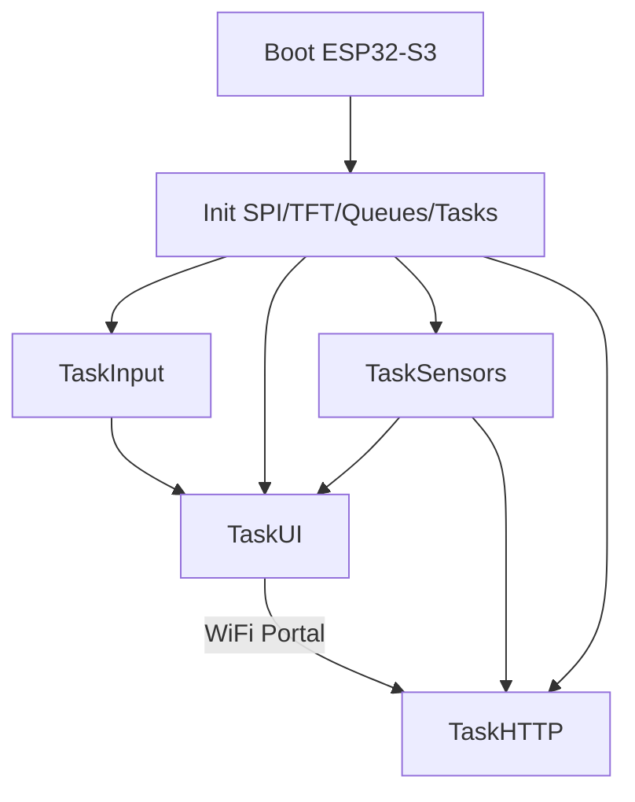
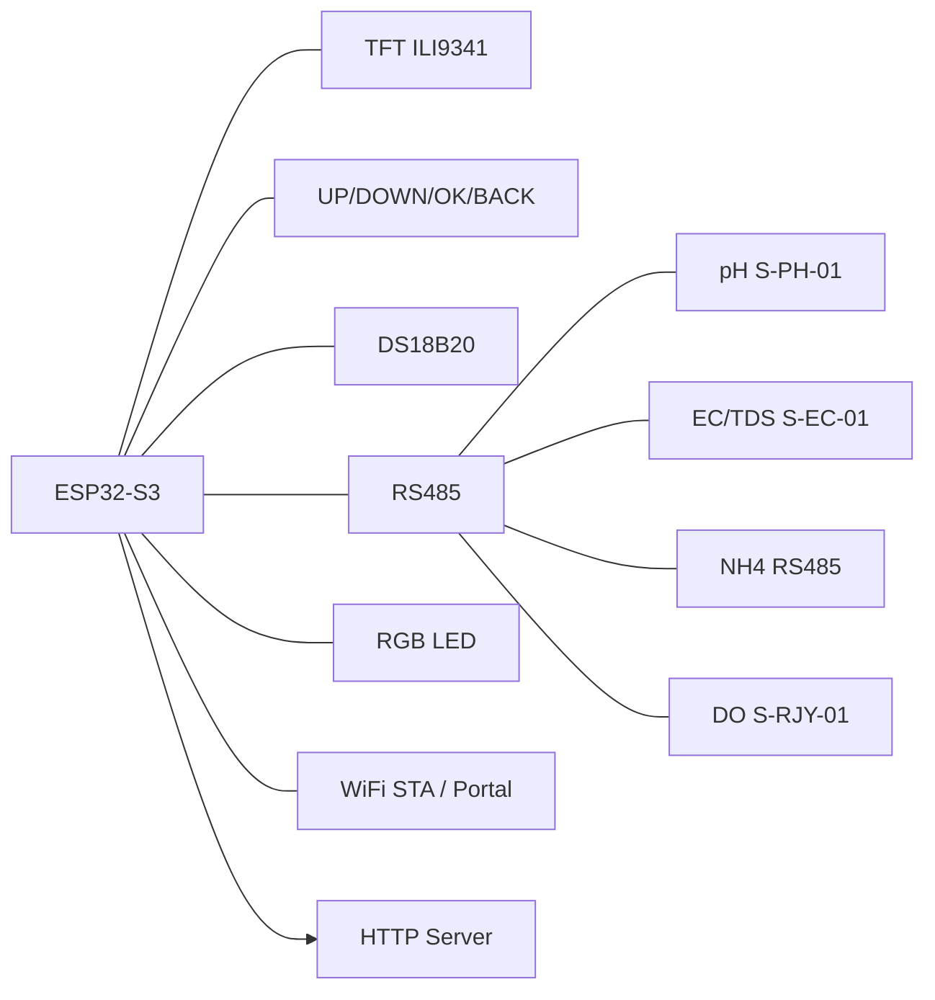
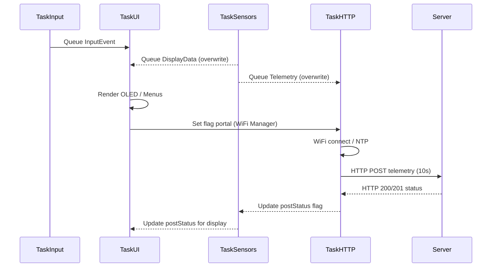

# Aquanotes Triangle (ESP32-S3)

UI RTOS untuk ESP32-S3 dengan 4 tombol (UP/DOWN/OK/BACK) dan TFT ILI9341 320x240. Proyek ini membaca sensor pH (S-PH-01), EC/TDS/Salinitas (S-EC-01), NH4 (RS485), DO (S-RJY-01) dan suhu DS18B20, lalu menampilkan ke TFT serta mengirim telemetry ke server HTTP. Firmware juga menyediakan indikator RGB LED (common cathode) untuk status runtime.

## Build & Flash (PlatformIO)
- Prasyarat: PlatformIO CLI atau VSCode + PlatformIO.
- Board: `esp32-s3-devkitc-1`
- Flash & monitor:
  ```sh
  pio run -t upload
  pio device monitor -b 115200
  ```

## Navigasi UI (OLED + 4 Tombol)
- OK dari dashboard: buka main menu. BACK: kembali ke dashboard.
- Main menu:
  - Dashboard: kembali ke layar utama.
  - WiFi Manager: mulai portal WiFi (captive portal) untuk konfigurasi SSID/password.
  - Kalibrasi Sensor: masuk submenu kalibrasi.
- WiFi Manager: OK untuk menyalakan portal WiFi.
- Kalibrasi:
  - Cal EC (Auto): pilih 1413 uS/cm atau 12880 uS/cm, OK untuk kirim perintah kalibrasi (Modbus).
  - Cal NH4: (placeholder, belum diimplementasi pada firmware ini).
  - Cal DO: Temp from DS (kirim suhu DS18B20), Zero, Slope.
  - Cal pH (S-PH-01): pH 4.01 / 7.00 / 10.01 atau pengaturan kompensasi suhu (External/Off/Onboard).
  - BACK di submenu manapun: kembali ke dashboard.

## Pinout & Wiring (ESP32-S3)
### TFT ILI9341 (SPI)
- TFT_CS: GPIO10
- TFT_DC: GPIO9
- TFT_RST: GPIO8
- TFT_MOSI: GPIO11
- TFT_MISO: GPIO13 (opsional, biasanya tidak dipakai oleh ILI9341)
- TFT_SCK: GPIO12

### Tombol (aktif LOW, INPUT_PULLUP)
- BTN_UP: GPIO5
- BTN_DOWN: GPIO6
- BTN_OK: GPIO7
- BTN_BACK: GPIO17

### RS485
- RS485_RX: GPIO16
- RS485_TX: GPIO15
- RS485_DE/RE: GPIO14

### DS18B20
- DATA: GPIO18

### Battery Sense (SEN-0052)
- BAT_ADC_PIN: GPIO1 (analog)

### RGB LED (DSP-0031, common cathode)
- LED_R: GPIO2 (PWM)
- LED_G: GPIO3 (PWM)
- LED_B: GPIO4 (PWM)
- Cathode: GND
- Resistor: 220–330Ω per channel

## Indikator LED (RGB)
- Hijau solid: sistem normal (WiFi OK + NTP OK + Modbus OK).
- Biru blink lambat: WiFi belum terhubung / sedang konek.
- Kuning blink lambat: WiFi OK tapi NTP belum sync.
- Merah blink cepat: error kritis (Modbus gagal berulang atau POST error berulang).
- Cyan flash: POST sukses.
- Magenta flash: kalibrasi sukses (Cal OK).
- Merah flash: kalibrasi gagal (Cal Fail).

## Telemetry HTTP
- Endpoint: `https://aeraseaku.inkubasistartupunhas.id/sensor/`
- Payload: JSON berisi UID, suhu, pH, DO, TDS, NH4, salinitas, timestamp.
- Interval: 10 s (konfigurasi `POST_INTERVAL_MS`).

## Galeri
- Tambahkan path gambar di sini (mis. `assets/foto-rakit.jpg`).

## Diagram (Mermaid)

### Flowchart Utama


### Block Diagram


### Sequence / Data Flow

