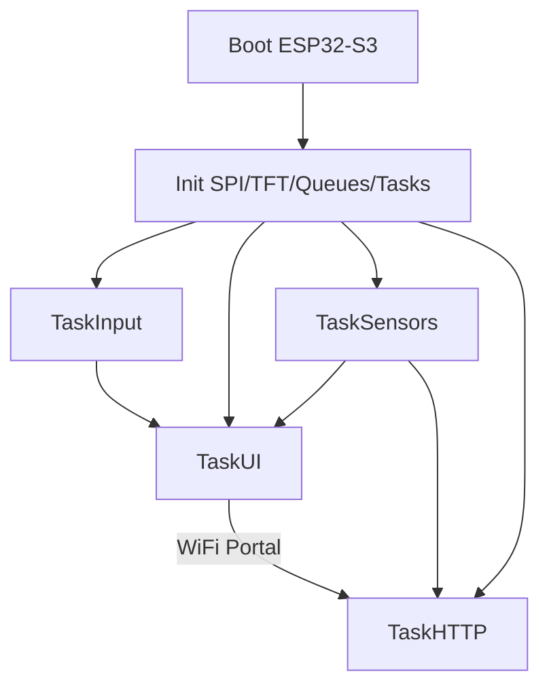
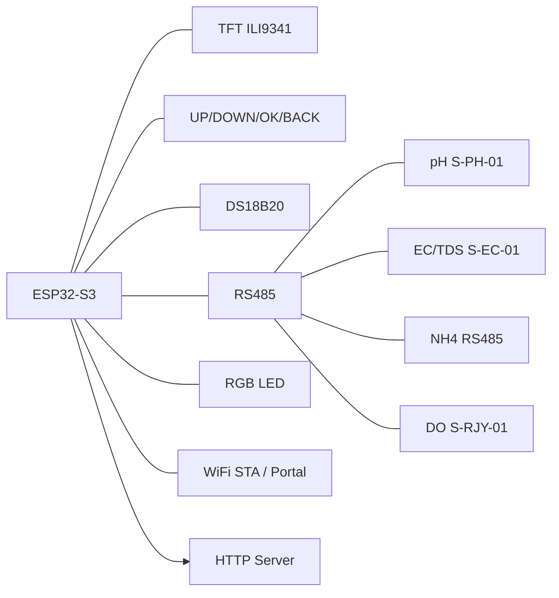
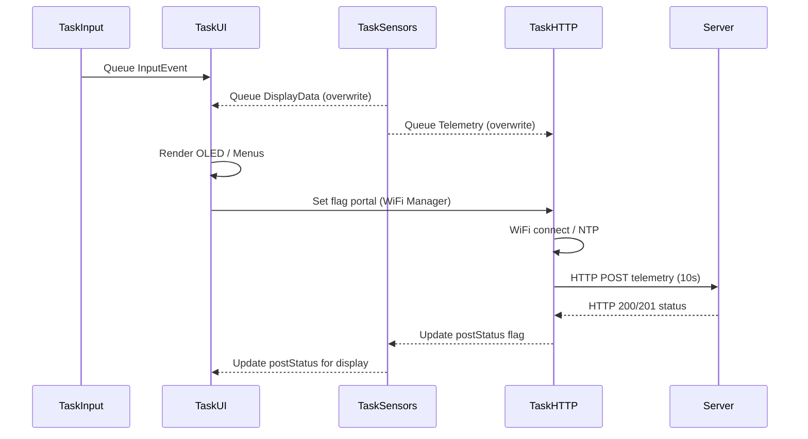

# Aquanotes Triangle (ESP32-S3)

UI RTOS untuk ESP32-S3 dengan 4 tombol (UP/DOWN/OK/BACK) dan TFT ILI9341 320x240. Proyek ini membaca sensor pH (S-PH-01), EC/TDS/Salinitas (S-EC-01), NH4 (RS485), dan DO (S-RJY-01), lalu menampilkan data ke TFT serta mengirim telemetry ke server HTTP. Firmware juga menyediakan indikator RGB LED, kontrol backlight, dan status runtime untuk koneksi WiFi/NTP/HTTP.

## Perubahan Terbaru
- Pembacaan sensor pH diubah mengikuti pola sensor DO: `function 0x03`, start address `0x0000`, panjang `0x0006`, parse `float32 big-endian`.
- Pembacaan sensor EC/TDS/Salinitas diubah mengikuti pola sensor DO: `function 0x03`, start address `0x0000`, panjang `0x000A`, parse `float32 big-endian`.
- `Slave ID` sensor tetap mengikuti konfigurasi firmware saat ini:
  - pH: `12`
  - EC/TDS/Sal: `30`
  - NH4: `1`
  - DO: `55`
- Nilai dashboard dipendekkan agar fokus ke angka, lalu ukuran font diperkecil otomatis bila teks terlalu lebar.
- Area box sensor sekarang dibersihkan setiap redraw sehingga angka baru tidak menimpa label atau sisa frame sebelumnya.
- Suhu utama dashboard di-resolve dari suhu internal sensor modular yang valid (`pH`, `EC`, `NH4`, lalu `DO` sebagai fallback berurutan).

## Build & Flash (PlatformIO)
- Prasyarat: PlatformIO CLI atau VSCode + PlatformIO.
- Board: `esp32-s3-devkitc-1`
- Flash & monitor:
  ```sh
  pio run -t upload
  pio device monitor -b 115200
  ```

## Navigasi UI (TFT + 4 Tombol)
- OK dari dashboard: buka main menu. BACK: kembali ke dashboard.
- Main menu:
  - Dashboard: kembali ke layar utama.
  - WiFi Manager: mulai portal WiFi (captive portal) untuk konfigurasi SSID/password.
  - Kalibrasi Sensor: masuk submenu kalibrasi.
- WiFi Manager: OK untuk menyalakan portal WiFi.
- Kalibrasi:
  - pH: buffer pH 7.00, pH 4.00, dan pH 10.00. Untuk kalibrasi dua titik, lakukan pH 7 lalu pH 4.
  - EC: larutan standar 1.413 mS/cm atau 12.88 mS/cm.
  - DO: kalibrasi nol menggunakan larutan Na2SO3 atau kalibrasi udara 100% saturasi.
  - Setiap pilihan membuka wizard persiapan, waktu tunggu, nilai sensor langsung, konfirmasi, dan hasil kalibrasi.
  - Tombol BACK kembali satu tingkat dan membatalkan wizard selama perintah belum dikirim.

## Pinout & Wiring (ESP32-S3)
### TFT ILI9341 (SPI)
- TFT_CS: GPIO10
- TFT_DC: GPIO9
- TFT_RST: GPIO8
- TFT_MOSI: GPIO11
- TFT_MISO: GPIO13 (opsional, biasanya tidak dipakai oleh ILI9341)
- TFT_SCK: GPIO12
- TFT_BL: GPIO21

### Tombol (aktif LOW, INPUT_PULLUP)
- BTN_UP: GPIO5
- BTN_DOWN: GPIO6
- BTN_OK: GPIO7
- BTN_BACK: GPIO17

### RS485
- RS485_RX: GPIO16
- RS485_TX: GPIO15
- RS485_DE/RE: GPIO14

### Battery Sense (SEN-0052)
- BAT_ADC_PIN: GPIO1 (analog)

### RGB LED (DSP-0031, common cathode)
- LED_R: GPIO2 (PWM)
- LED_G: GPIO3 (PWM)
- LED_B: GPIO4 (PWM)
- Cathode: GND
- Resistor: 220–330Ω per channel

## Indikator LED (RGB)
- Hijau solid: sistem normal (WiFi OK + NTP OK + Modbus OK).
- Biru blink lambat: WiFi belum terhubung / sedang konek.
- Kuning blink lambat: WiFi OK tapi NTP belum sync.
- Merah blink cepat: error kritis (Modbus gagal berulang atau POST error berulang).
- Cyan flash: POST sukses.
- Magenta flash: kalibrasi sukses (Cal OK).
- Merah flash: kalibrasi gagal (Cal Fail).

## Telemetry HTTP
- Endpoint: `https://aeraseaku.inkubasistartupunhas.id/sensor/`
- Payload: JSON berisi UID, suhu, pH, DO, TDS, NH4, salinitas, timestamp.
- Nilai `salinitas` yang dikirim ke server memakai satuan `ppt`.
- Interval: 10 s (konfigurasi `POST_INTERVAL_MS`).

## Modbus Ringkas
### pH S-PH-01
- Slave ID firmware: `12`
- Read realtime: `0x03`, start `0x0000`, count `6`
- Format data: `[pH][internal][temperature]` sebagai `float32 big-endian`

### EC S-EC-01
- Slave ID firmware: `30`
- Read realtime: `0x03`, start `0x0000`, count `10`
- Format data: `[EC][internal][temperature][TDS][salinity]` sebagai `float32 big-endian`
- Nilai EC dari sensor ditampilkan dalam `mS/cm` dengan dua angka desimal.
- Dashboard menampilkan kartu `Salinity` dalam `ppt` menggunakan nilai salinitas sensor EC yang dikonversi dari `ppm`.

### NH4
- Slave ID firmware: `1`
- Tetap dibaca via register holding sesuai implementasi saat ini

### DO S-RJY-01
- Slave ID firmware: `55`
- Read realtime: `0x03`, start `0x0000`, count `6`
- Format data: `[DO][saturation][temperature]` sebagai `float32 big-endian`

## Galeri
- Tambahkan path gambar di sini (mis. `assets/foto-rakit.jpg`).

## Diagram (Mermaid)

### Flowchart Utama

```mermaid
flowchart TD
  A[Boot ESP32-S3] --> B[Init SPI/TFT/Queues/Tasks]
  B --> C[TaskInput]
  B --> D[TaskUI]
  B --> E[TaskSensors]
  B --> F[TaskHTTP]
  C --> D
  E --> D
  E --> F
  D -->|WiFi Portal| F
```

### Block Diagram

```mermaid
graph LR
  MCU[ESP32-S3] --- TFT[TFT ILI9341]
  MCU --- Buttons[UP/DOWN/OK/BACK]
  MCU --- DS18B20
  MCU --- RS485
  MCU --- RGBLED[RGB LED]
  RS485 --- PH[pH S-PH-01]
  RS485 --- EC[EC/TDS S-EC-01]
  RS485 --- NH4[NH4 RS485]
  RS485 --- DO[DO S-RJY-01]
  MCU --- WiFi[WiFi STA / Portal]
  MCU --> Server[HTTP Server]
```

### Sequence / Data Flow

```mermaid
sequenceDiagram
  participant Btn as TaskInput
  participant UI as TaskUI
  participant S as TaskSensors
  participant H as TaskHTTP
  participant SV as Server

  Btn->>UI: Queue InputEvent
  S-->>UI: Queue DisplayData (overwrite)
  S-->>H: Queue Telemetry (overwrite)
  UI->>UI: Render OLED / Menus
  UI->>H: Set flag portal (WiFi Manager)
  H->>H: WiFi connect / NTP
  H->>SV: HTTP POST telemetry (10s)
  SV-->>H: HTTP 200/201 status
  H-->>S: Update postStatus flag
  S-->>UI: Update postStatus for display
```
