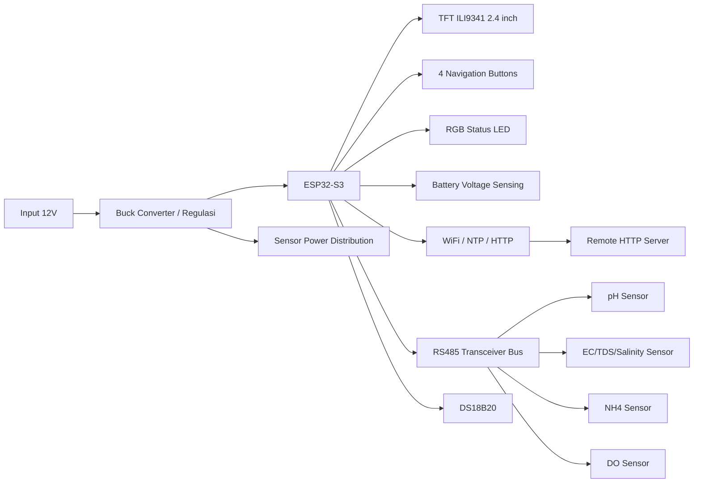
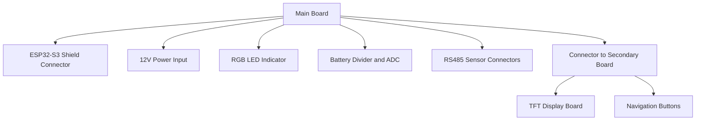
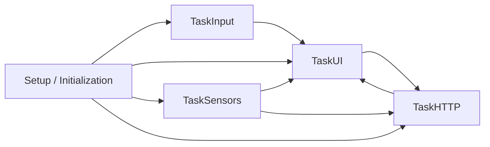
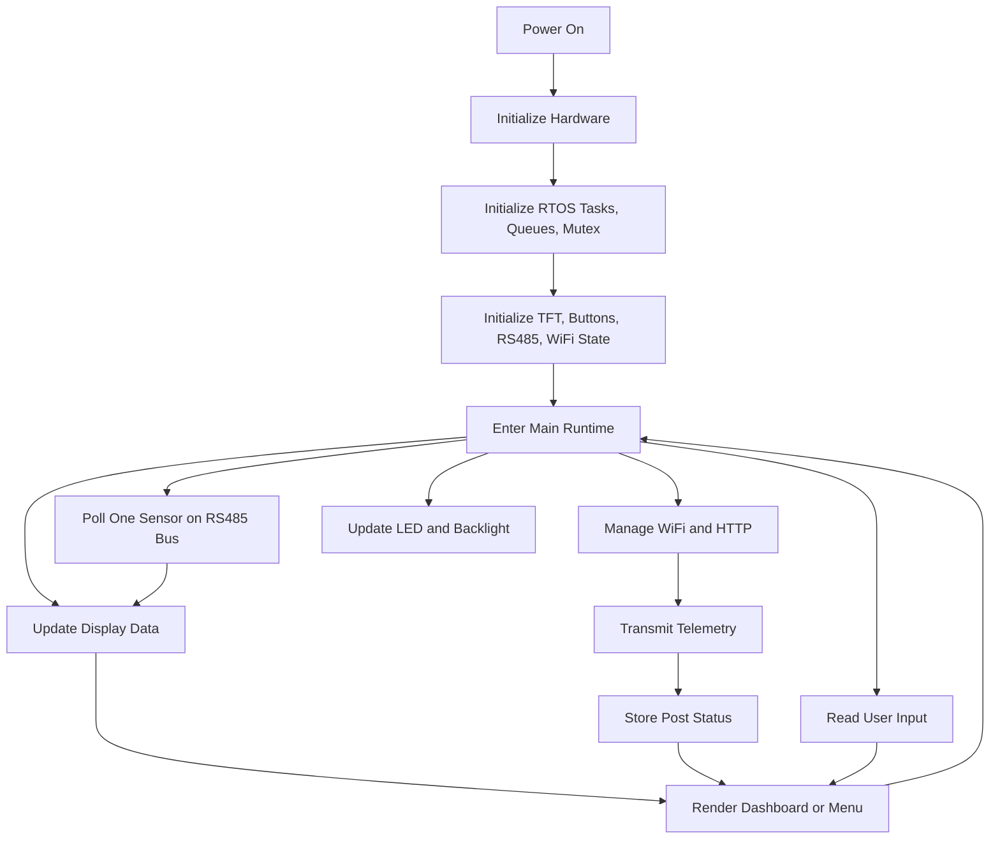
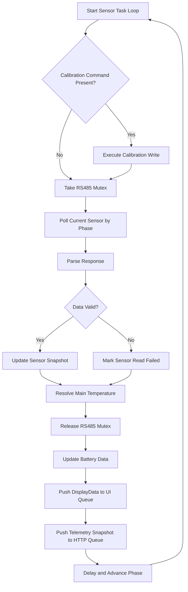
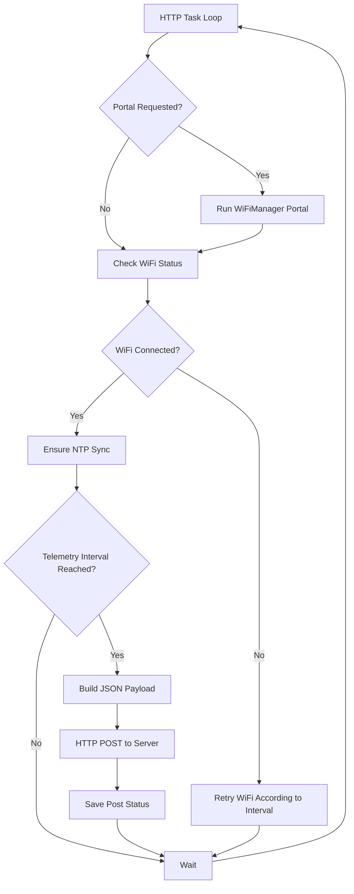
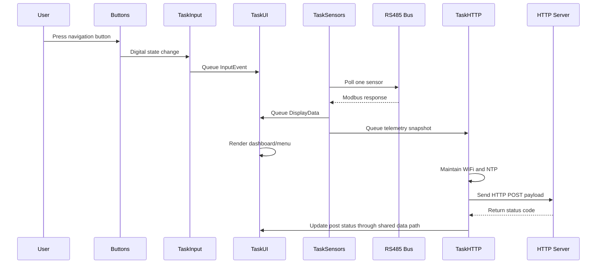

# Draft Paten Aquanotes Triangle

Dokumen ini adalah draft teknis awal untuk membantu penyusunan dokumen paten proyek `Aquanotes Triangle`. Dokumen ini disusun dari implementasi firmware, README proyek, dan skematik hardware yang tersedia di repositori. Dokumen ini belum merupakan nasihat hukum dan masih perlu disesuaikan oleh konsultan/pihak hukum paten sebelum diajukan resmi.

## 1. Judul Invensi
Sistem Perangkat Pemantau Kualitas Air Portabel Berbasis Mikrokontroler dengan Akuisisi Multi-Sensor RS485, Antarmuka Layar TFT, Manajemen Daya, dan Telemetri Nirkabel

## 2. Bidang Teknik Invensi
Invensi ini berada pada bidang:
- Instrumentasi kualitas air
- Sistem pemantauan lingkungan berbasis embedded system
- Perangkat Internet of Things untuk akuisisi data sensor
- Sistem antarmuka manusia-mesin portabel untuk pemantauan multi-parameter cairan

## 3. Latar Belakang
Pemantauan kualitas air pada akuakultur, riset lingkungan, laboratorium lapangan, dan sistem budidaya modern umumnya membutuhkan beberapa alat ukur terpisah untuk parameter seperti pH, dissolved oxygen (DO), electrical conductivity (EC), total dissolved solids (TDS), salinitas, dan amonium (NH4). Pendekatan tersebut menghasilkan beberapa kendala:
- Instalasi sensor dan modul pembaca menjadi terpisah-pisah.
- Data sulit dikonsolidasikan secara real-time dalam satu antarmuka.
- Sinkronisasi pembacaan antar sensor sering tidak konsisten.
- Pengguna lapangan membutuhkan perangkat portabel yang dapat langsung menampilkan hasil, menyimpan konteks status sistem, dan mengirim data ke server.
- Solusi yang ada sering tidak mengintegrasikan layar lokal, telemetri nirkabel, indikator status, manajemen daya baterai, dan kalibrasi sensor dalam satu perangkat.

Invensi ini menawarkan arsitektur perangkat terpadu yang menggabungkan multi-sensor kualitas air berbasis RS485 dan satu sistem kontrol pusat berbasis ESP32-S3 dengan layar TFT, kontrol tombol, konektivitas WiFi, dan firmware multitask berbasis RTOS.

## 4. Tujuan Invensi
Tujuan invensi ini adalah menyediakan perangkat portabel pemantau kualitas air yang:
- Mampu membaca beberapa sensor kualitas air melalui satu bus RS485.
- Menampilkan data parameter air secara lokal pada layar TFT.
- Menyediakan antarmuka pengguna berbasis tombol untuk navigasi dan kalibrasi.
- Mendukung telemetri nirkabel ke server jarak jauh.
- Memiliki arsitektur board yang dipisah antara papan utama dan papan antarmuka.
- Mengelola daya, backlight, status baterai, dan indikator visual sistem secara terpadu.
- Menyederhanakan proses instalasi sensor melalui konektor terstandar.

## 5. Ringkasan Invensi
Invensi ini berupa alat pemantau kualitas air portabel yang terdiri atas papan utama berbasis ESP32-S3 dan papan sekunder untuk antarmuka pengguna, di mana papan utama terhubung ke beberapa sensor kualitas air, terutama sensor pH, EC/TDS/salinitas, NH4, DO, serta sensor suhu digital. Sistem melakukan polling data sensor secara bergantian pada bus RS485, mengolah data hasil pembacaan, menampilkan hasil pada layar TFT 2.4 inci, memberi indikasi status sistem melalui LED RGB, dan mengirimkan data secara berkala melalui WiFi ke server HTTP.

Arsitektur firmware menggunakan pemisahan tugas untuk input, antarmuka tampilan, akuisisi sensor, dan komunikasi HTTP. Dengan pendekatan ini, perangkat mampu menjalankan akuisisi multi-sensor, rendering layar, dan telemetri secara paralel tanpa mengganggu respons antarmuka pengguna.

## 6. Uraian Singkat Gambar/Skematik
Skematik yang digunakan sebagai dasar draft ini:
- Main board: 

- Secondary board: 

## 7. Uraian Sistem Secara Umum

### 7.1 Komponen Utama Sistem
Sistem sekurang-kurangnya terdiri dari:
- Mikrokontroler `ESP32-S3`
- Layar `TFT ILI9341 2.4 inci` berbasis SPI
- Tombol navigasi `UP`, `DOWN`, `OK`, `BACK`
- Bus komunikasi `RS485`
- Sensor pH digital RS485
- Sensor EC/TDS/salinitas digital RS485
- Sensor NH4 digital RS485
- Sensor DO digital RS485
- Sensor suhu digital `DS18B20`
- Modul indikator `RGB LED`
- Pembaca tegangan baterai melalui pembagi tegangan
- Koneksi `WiFi` untuk telemetri dan sinkronisasi waktu

### 7.2 Parameter yang Dipantau
Perangkat memantau sekurang-kurangnya:
- Suhu air
- pH
- Dissolved oxygen
- Electrical conductivity
- Total dissolved solids
- Salinitas
- Amonium/NH4
- Tegangan baterai
- Status konektivitas WiFi
- Status sinkronisasi waktu/NTP
- Status pengiriman data ke server

## 8. Arsitektur Hardware

### 8.1 Main Board
Berdasarkan skematik `Main Board`, papan utama memuat:
- Konektor ke modul `ESP32-S3 Shield`
- Konektor ke `secondary PCB`
- Konektor sensor melalui aviation plug
- Konektor RS485 umum
- Konektor daya `12V`
- Rangkaian pembagi tegangan untuk pengukuran baterai
- Rangkaian indikator `RGB LED`
- Tombol `manual reset`

Fungsi main board adalah sebagai inti pemrosesan, distribusi daya, manajemen konektor sensor, dan terminasi sinyal utama perangkat.

### 8.2 Secondary Board
Berdasarkan skematik `Secondary Board`, papan sekunder memuat:
- Modul `TFT LCD 2.4 inci` dengan antarmuka `SPI`
- Jalur backlight TFT yang dikendalikan transistor `2N3904`
- Konektor ke main board untuk sinyal TFT
- Konektor ke main board untuk tombol navigasi
- Empat tombol navigasi fisik

Fungsi secondary board adalah memisahkan area antarmuka pengguna dari area kontrol dan sensor, sehingga desain mekanik perangkat lebih modular.

### 8.3 Konektor Sensor
Dari skematik main board, sensor-sensor dihubungkan melalui:
- `U4`: pH RS485
- `U5`: DO RS485
- `U6`: NH4 RS485
- `U7`: EC RS485
- `U10`: DS18B20
- `J1`: konektor RS485 umum

Tiap konektor sensor membawa sekurang-kurangnya:
- Catu daya `12V`
- Jalur diferensial komunikasi RS485 `A/B` untuk sensor RS485
- Ground

Untuk DS18B20 digunakan:
- `3V3`
- `DATA` pada `GPIO18`
- `GND`

### 8.4 Pemetaan Pin Mikrokontroler
Implementasi firmware dan skematik menunjukkan pemetaan utama berikut:
- `GPIO10`: TFT_CS
- `GPIO9`: TFT_DC
- `GPIO8`: TFT_RST
- `GPIO11`: TFT_MOSI
- `GPIO12`: TFT_SCK
- `GPIO13`: TFT_MISO
- `GPIO21`: TFT backlight control
- `GPIO5`: tombol UP
- `GPIO6`: tombol DOWN
- `GPIO7`: tombol OK
- `GPIO17`: tombol BACK
- `GPIO16`: RS485_RX
- `GPIO15`: RS485_TX
- `GPIO14`: RS485_DE/RE
- `GPIO1`: battery ADC
- `GPIO2`, `GPIO3`, `GPIO4`: RGB LED
- `GPIO18`: DS18B20

## 9. Arsitektur Fungsional Sistem

### 9.1 Block Diagram Sistem

### 9.2 Block Diagram Board-Level

### 9.3 Block Diagram Firmware

## 10. Arsitektur Firmware
Firmware diimplementasikan pada `ESP32-S3` menggunakan pendekatan multitasking berbasis RTOS. Arsitektur tugas terdiri atas:

### 10.1 TaskInput
Tugas ini membaca tombol navigasi fisik:
- UP
- DOWN
- OK
- BACK

Setiap masukan didebounce dan dikirim ke antrean `InputEvent` untuk diproses oleh antarmuka pengguna.

### 10.2 TaskUI
Tugas ini mengelola:
- Tampilan splash screen
- Dashboard parameter kualitas air
- Menu utama
- Menu kalibrasi
- Status WiFi/NTP/HTTP
- Toast notification
- Backlight timeout
- Indikator LED sesuai status runtime

### 10.3 TaskSensors
Tugas ini mengelola:
- Akses bus RS485 dengan mutex
- Polling sensor secara bergantian
- Resolusi nilai suhu utama
- Penyusunan `DisplayData`
- Pengiriman snapshot data ke task UI dan task HTTP
- Eksekusi perintah kalibrasi sensor

### 10.4 TaskHTTP
Tugas ini mengelola:
- Koneksi WiFi
- Portal konfigurasi WiFi melalui `WiFiManager`
- Sinkronisasi waktu menggunakan NTP
- HTTP POST telemetri
- Pelaporan status pengiriman

## 11. Metode Akuisisi Sensor

### 11.1 Konsep Akuisisi
Sensor tidak dibaca serempak, melainkan dipolling bergantian pada bus RS485 bersama. Hal ini memberikan beberapa keunggulan:
- Mengurangi tabrakan trafik pada bus
- Menurunkan beban pemrosesan instan
- Menjaga respons UI tetap stabil
- Mempermudah integrasi sensor dengan protokol berbeda tetapi media yang sama

### 11.2 Urutan Polling Sensor
Urutan polling implementasi saat ini:
1. Sensor pH
2. Sensor EC/TDS/salinitas
3. Sensor NH4
4. Sensor DO

Setelah satu siklus selesai, sistem mengulang dari awal.

### 11.3 Format Data Sensor
Implementasi firmware saat ini menggunakan identitas slave:
- pH: `12`
- EC/TDS/Sal: `30`
- NH4: `1`
- DO: `55`

Pembacaan realtime:
- pH: `function 0x03`, `start 0x0000`, `count 6`, format `[pH][internal][temperature]` dalam `float32 big-endian`
- EC: `function 0x03`, `start 0x0000`, `count 10`, format `[EC][internal][temperature][TDS][salinity]` dalam `float32 big-endian`
- NH4: holding register sesuai implementasi vendor saat ini
- DO: `function 0x03`, `start 0x0000`, `count 6`, format `[DO][saturation][temperature]` dalam `float32 big-endian`

### 11.4 Validasi Data
Firmware melakukan validasi pembacaan, misalnya:
- Menolak nilai non-finite
- Menolak suhu di luar rentang operasional logis
- Menolak nilai negatif untuk parameter yang tidak mungkin negatif

Validasi ini penting karena perangkat ditujukan untuk pemantauan lapangan yang rentan terhadap gangguan kabel, noise, atau respons sensor yang tidak valid.

## 12. Metode Penentuan Suhu Utama
Perangkat menyimpan beberapa suhu internal dari berbagai sensor. Untuk tampilan utama dan payload telemetri, suhu utama ditentukan menggunakan prioritas:
1. Suhu internal sensor pH
2. Suhu internal sensor EC
3. Suhu internal sensor NH4
4. Suhu internal sensor DO

Metode ini memastikan perangkat tetap memiliki nilai suhu representatif walaupun salah satu sensor tertentu tidak aktif atau gagal dibaca.

## 13. Antarmuka Pengguna

### 13.1 Dashboard
Dashboard menampilkan sekurang-kurangnya:
- Temperature
- Dissolved O2
- pH
- NH4
- EC
- TDS

Setiap parameter ditampilkan dalam kotak tersendiri pada TFT. Firmware menyesuaikan ukuran font otomatis agar nilai tetap berada dalam area box dan tidak menimpa elemen lain.

### 13.2 Menu
Menu utama sekurang-kurangnya terdiri dari:
- Dashboard
- WiFi Manager
- Kalibrasi Sensor

Submenu kalibrasi mencakup:
- Kalibrasi EC
- Kalibrasi NH4
- Kalibrasi DO
- Kalibrasi pH

### 13.3 Indikator Visual
LED RGB menunjukkan status sistem:
- Hijau: sistem normal
- Biru berkedip: WiFi belum terkoneksi
- Kuning berkedip: WiFi aktif tetapi waktu belum sinkron
- Merah berkedip cepat: kesalahan kritis
- Cyan flash: POST sukses
- Magenta flash: kalibrasi berhasil
- Merah flash: kalibrasi gagal

## 14. Telemetri dan Konektivitas
Perangkat terhubung ke server menggunakan WiFi dan melakukan pengiriman data berkala ke endpoint HTTP. Payload sekurang-kurangnya meliputi:
- `uid`
- `suhu`
- `ph`
- `do`
- `tds`
- `ammonia`
- `salinitas`
- `battery_v`
- `battery_pct`
- `timestamp`

Konektivitas juga mencakup:
- Portal konfigurasi WiFi
- Sinkronisasi NTP
- Monitoring status koneksi

## 15. Manajemen Daya
Sistem menggunakan suplai utama `12V` dan sekurang-kurangnya memiliki:
- Konektor input daya
- Jalur menuju buck converter
- Pembagi tegangan untuk membaca tegangan baterai/suplai
- Kontrol backlight TFT untuk menghemat daya

Firmware mematikan backlight setelah periode tidak ada interaksi, lalu menyalakannya kembali saat pengguna menekan tombol.

## 16. Flowchart Operasi Sistem

### 16.1 Flowchart Umum

### 16.2 Flowchart Akuisisi Sensor

### 16.3 Flowchart Komunikasi HTTP

## 17. Diagram Urutan Data

## 18. Aspek Kebaruan yang Dapat Ditekankan
Berikut poin kebaruan teknis yang berpotensi ditekankan dalam penyusunan paten:
- Integrasi beberapa sensor kualitas air digital berbeda pada satu perangkat portabel dengan satu bus RS485 bersama.
- Arsitektur dua papan, yaitu papan utama dan papan sekunder antarmuka, untuk memisahkan domain kontrol dan domain UI.
- Mekanisme polling sensor bergilir dengan validasi data dan fallback suhu utama.
- Integrasi dashboard lokal, menu kalibrasi, telemetri HTTP, indikator LED status, dan manajemen backlight dalam satu sistem embedded.
- Penggunaan satu perangkat untuk menggabungkan fungsi akuisisi, tampilan lokal, komunikasi cloud, dan pemeliharaan operasional lapangan.
- Struktur konektor sensor yang siap pakai melalui aviation plug dan konektor RS485 umum.

## 19. Contoh Klaim Teknis Awal
Bagian ini masih draft dan perlu dirapikan oleh konsultan paten.

### Klaim Mandiri Contoh
Suatu perangkat pemantau kualitas air portabel yang mencakup:
- sebuah mikrokontroler;
- sebuah antarmuka layar;
- sebuah antarmuka pengguna berbasis tombol;
- sebuah bus komunikasi RS485 yang terhubung ke beberapa sensor kualitas air digital;
- sebuah modul komunikasi nirkabel;
- sebuah rangkaian pemantauan daya;
- dan firmware multitugas;

di mana firmware tersebut dikonfigurasi untuk:
- membaca beberapa sensor kualitas air secara bergantian melalui bus RS485;
- memvalidasi hasil pembacaan sensor;
- menentukan nilai suhu utama dari beberapa sumber suhu sensor;
- menampilkan nilai parameter air pada layar lokal;
- menerima perintah pengguna untuk navigasi dan kalibrasi;
- serta mengirimkan data pengukuran ke server jarak jauh melalui jaringan nirkabel.

### Klaim Turunan Contoh
- Perangkat menurut klaim sebelumnya, di mana antarmuka layar berupa TFT SPI 2.4 inci.
- Perangkat menurut klaim sebelumnya, di mana perangkat dibagi menjadi papan utama dan papan sekunder.
- Perangkat menurut klaim sebelumnya, di mana papan sekunder memuat layar dan tombol navigasi.
- Perangkat menurut klaim sebelumnya, di mana perangkat mencakup indikator LED RGB untuk menandai status operasi.
- Perangkat menurut klaim sebelumnya, di mana sensor yang didukung mencakup paling sedikit sensor pH, DO, EC, NH4, dan suhu.
- Perangkat menurut klaim sebelumnya, di mana firmware menentukan suhu utama dengan fallback dari beberapa sensor internal.
- Perangkat menurut klaim sebelumnya, di mana backlight layar dikontrol otomatis berdasarkan aktivitas pengguna.

## 20. Implementasi Aktual Pada Proyek Ini
Implementasi saat ini pada repositori ini menunjukkan:
- Board target: `esp32-s3-devkitc-1`
- Framework: `Arduino`
- Library utama:
  - `Adafruit GFX`
  - `Adafruit ILI9341`
  - `ModbusMaster`
  - `WiFiManager`
- Endpoint telemetri: `https://aeraseaku.inkubasistartupunhas.id/sensor/`
- Identitas perangkat contoh: `UID AER2023AQ0019`

## 21. Referensi Internal Proyek
- Firmware utama: [src/main.cpp](/d:/Aerasea/aquanotes-segitiga/aquanotes-triangle/src/main.cpp)
- Struktur data UI: [include/ui_types.h](/d:/Aerasea/aquanotes-segitiga/aquanotes-triangle/include/ui_types.h)
- Konfigurasi build: [platformio.ini](/d:/Aerasea/aquanotes-segitiga/aquanotes-triangle/platformio.ini)
- Ringkasan proyek: [README.md](/d:/Aerasea/aquanotes-segitiga/aquanotes-triangle/README.md)
- Skematik main board: [Schematic_Portable-Aquanotes-Main-Board-copy_2026-04-16.png](/d:/Aerasea/aquanotes-segitiga/aquanotes-triangle/schematics/Schematic_Portable-Aquanotes-Main-Board-copy_2026-04-16.png)
- Skematik secondary board: [Schematic_Portable-Aquanotes-Secondary-Board-copy_2026-04-16.png](/d:/Aerasea/aquanotes-segitiga/aquanotes-triangle/schematics/Schematic_Portable-Aquanotes-Secondary-Board-copy_2026-04-16.png)

## 22. Catatan Lanjutan
Untuk pengajuan paten yang lebih kuat, biasanya dokumen ini perlu dikembangkan lagi menjadi:
- abstrak invensi;
- uraian lengkap invensi;
- uraian singkat gambar;
- klaim final;
- gambar nomor referensi komponen;
- dan jika perlu, beberapa varian pelaksanaan.

Versi berikutnya dapat ditingkatkan dengan menambahkan:
- penomoran referensi tiap komponen pada skematik;
- uraian setiap pin/konektor sebagai elemen paten;
- varian arsitektur komunikasi selain HTTP;
- varian enclosure portabel;
- dan skenario penggunaan pada akuakultur, laboratorium lapangan, atau monitoring lingkungan.
