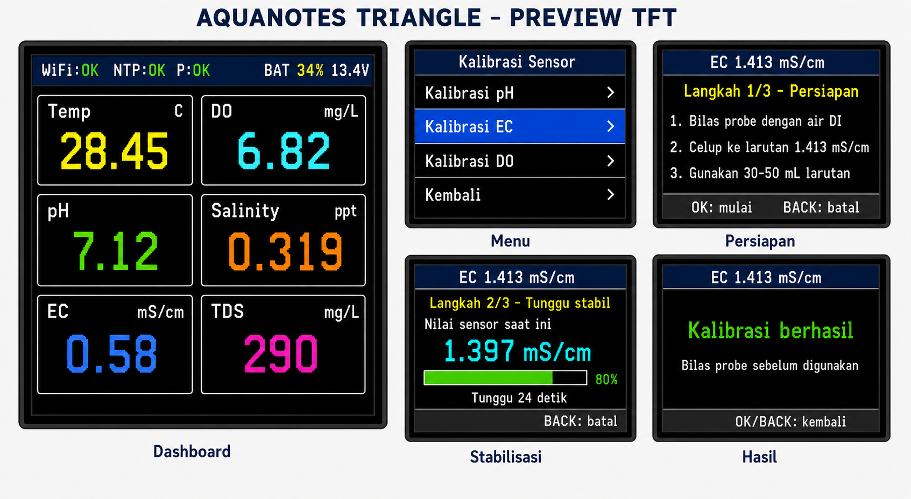

# Laporan Perbaikan Aquanotes Triangle

Tanggal: 16 Juni 2026  
Perangkat: Aquanotes Triangle, ESP32-S3 + TFT ILI9341 320x240

## Ringkasan

Perbaikan malam ini berfokus pada keterbacaan dashboard TFT dan perubahan menu kalibrasi menjadi alur bertahap yang dapat digunakan oleh pengguna nonteknis. Implementasi sudah melewati build PlatformIO tanpa error kompilasi.

## Perbaikan Dashboard

- Satuan EC dikonfirmasi sebagai `mS/cm` sesuai format float sensor RK500 EC.
- Nilai EC sebelumnya dibulatkan dengan format tanpa desimal sehingga nilai seperti `0.58` tampil sebagai `0`.
- Format EC sekarang memakai dua angka desimal, sehingga contoh pembacaan ditampilkan sebagai `0.58 mS/cm`.
- Satuan ditempatkan kecil pada kanan atas setiap card agar nilai utama tetap besar dan mudah dibaca.
- Label panjang disingkat untuk mempertahankan kerapian layar 320x240.

Satuan dashboard:

| Parameter | Tampilan |
| --- | --- |
| Suhu | `C` |
| Dissolved Oxygen | `mg/L` |
| pH | tanpa satuan |
| Salinitas | `ppt` |
| EC | `mS/cm` |
| TDS | `mg/L` |

## Perbaikan Menu Kalibrasi

Menu kalibrasi lama langsung menulis register setelah pengguna memilih titik kalibrasi. Alur tersebut diganti menjadi wizard tiga tahap:

1. **Persiapan**: layar menjelaskan cara membilas probe, larutan yang digunakan, dan volume yang disarankan.
2. **Tunggu stabil**: layar menampilkan nilai sensor secara langsung, countdown, dan progress bar.
3. **Simpan dan hasil**: perintah baru dikirim setelah waktu tunggu selesai, sensor terbaca, dan pengguna menekan `OK`. Hasil berhasil atau gagal ditampilkan berdasarkan respons Modbus.

Navigasi tombol:

- `UP/DOWN`: memilih sensor atau titik kalibrasi.
- `OK`: membuka pilihan, memulai waktu tunggu, atau menyimpan kalibrasi.
- `BACK`: kembali satu tingkat atau membatalkan wizard sebelum perintah dikirim.
- Ketika perintah sedang dikirim, pembatalan dinonaktifkan agar transaksi RS485 tidak terputus.

## Metode Kalibrasi

### pH

- Pilihan buffer: pH `7.00`, `4.00`, dan `10.00`.
- Urutan yang disarankan untuk dua titik: pH 7 kemudian pH 4.
- Register: `0x55`.
- Function: `0x06`, Write Single Register.
- Nilai yang ditulis: `7`, `4`, atau `10`.
- Waktu tunggu wizard: 60 detik.

### EC

- Pilihan larutan: `1.413 mS/cm` dan `12.88 mS/cm`.
- Register: `0x50`.
- Function: `0x10`, Write Multiple Registers.
- Data ditulis sebagai float IEEE754 dua register.
- Nilai yang ditulis adalah `1.413` atau `12.88`, bukan `1413`.
- Waktu tunggu wizard: 120 detik.

### Dissolved Oxygen

- Pilihan `Nol Oksigen` menggunakan larutan Na2SO3.
- Pilihan `Udara 100%` menggunakan probe bersih dan kering di udara bebas.
- Waktu tunggu wizard: 180 detik.
- Firmware menggunakan perintah zero dan air/slope sensor yang tersedia.

## Perbaikan Arsitektur Firmware

- Ditambahkan state UI khusus `CAL_WIZARD`.
- Ditambahkan queue hasil kalibrasi dari task sensor ke task UI.
- UI tidak lagi menganggap pengiriman perintah sebagai keberhasilan otomatis.
- Task sensor mengirim status sukses/gagal berdasarkan respons Modbus sebenarnya.
- Redraw wizard dibatasi sekitar satu kali per detik untuk mengurangi flicker TFT.
- Snapshot sensor tetap diperbarui sehingga nilai langsung dapat dipantau selama proses stabilisasi.

## Preview TFT

Gambar berikut merupakan mockup laporan berdasarkan layout dan teks yang diterapkan pada firmware. Gambar ini bukan foto hasil flash pada perangkat fisik.



## Verifikasi

Build dijalankan menggunakan PlatformIO untuk target `esp32-s3-devkitc-1`.

Hasil:

```text
SUCCESS
RAM:   14.9% (48,820 / 327,680 bytes)
Flash: 30.9% (1,033,181 / 3,342,336 bytes)
```

## Pengujian Lanjutan

Build memastikan firmware dapat dikompilasi, tetapi belum membuktikan keberhasilan kalibrasi pada sensor fisik. Pengujian perangkat perlu memverifikasi:

- urutan word float EC sesuai respons sensor yang digunakan;
- register zero dan air calibration DO sesuai unit sensor terpasang;
- respons sukses setelah penulisan register;
- keterbacaan teks pada TFT fisik;
- kestabilan nilai sensor selama countdown;
- hasil pembacaan setelah probe dibilas dan dikembalikan ke sampel air.

## Berkas Terkait

- Firmware: `src/main.cpp`
- State UI: `include/ui_types.h`
- Konteks metode: `calibration-context.md`
- Dokumentasi proyek: `README.md`
- Preview: `reports/assets/tft-ui-preview-2026-06-16.png`
